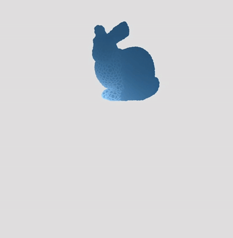
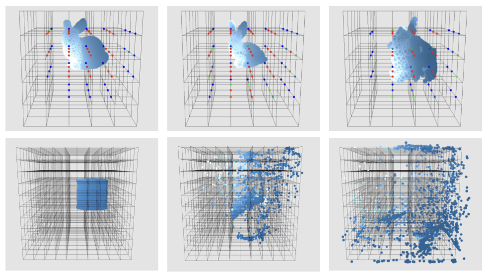

# melt-sim
## 🧊 MPM Melting Simulation

This project implements a real-time **Material Point Method (MPM)** simulation that models the melting transition from solid to liquid using a hybrid particle-grid framework. 

<p align="center" style="display: flex; justify-content: center; align-items: center; gap: 20px;">
  
  
</p>


## Required System Libraries
- OpenGL (version 3.3 or higher)
- CMake (version 3.14 or higher)
- Make (for building)


## Building the Project
Create a build directory and run CMake:
```bash
mkdir build && cd build
cmake ..
```

Build the project:
```bash
make
```

Run the executable (right now should only show a red cube with black background):
```bash
./MeltSim
```


## ✨ Features
* Mesh Importer with Surface and Volume Subsampling
* Hybrid MPM Solver with APIC interpolation
    * Visualize Grid and Node Activations
* Elastoplastic deformation using co-rotational stress
* Particle rendering with:
  * Ripple-based normal mapping  
  * Anisotropic specular highlights  
  * Fresnel rim lighting  
  * Squash-and-stretch deformation


<p align="center">
  
</p>

## 🌀 Bloopers
I
<p align="center">
  
</p>
